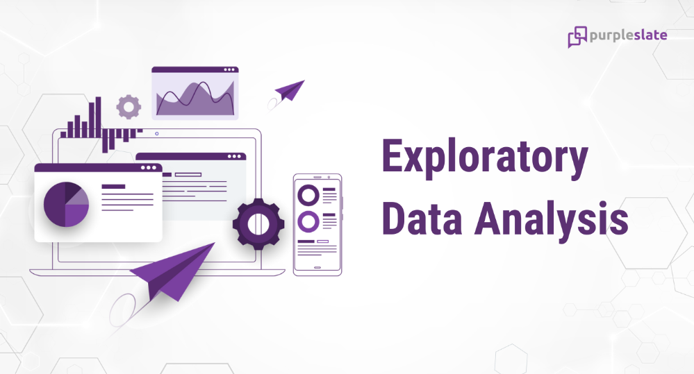
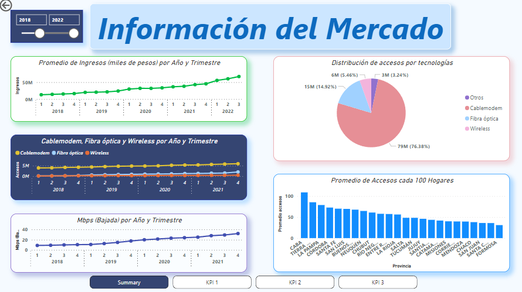
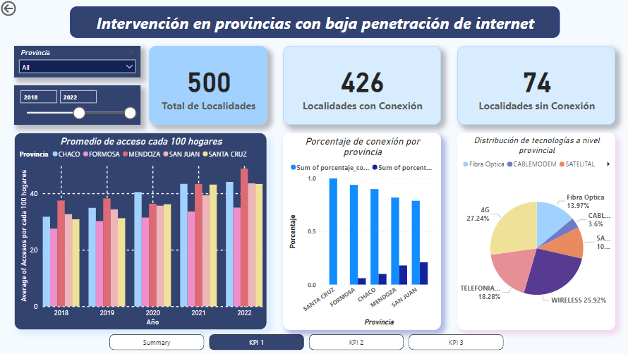
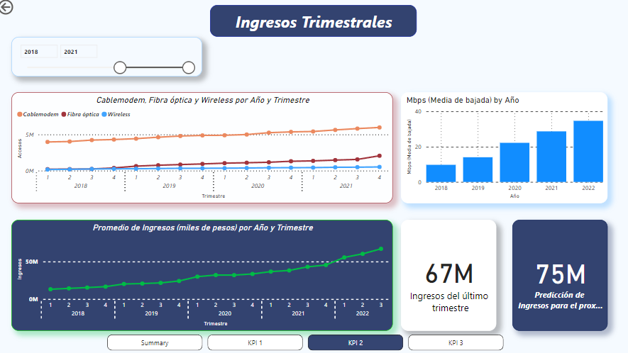
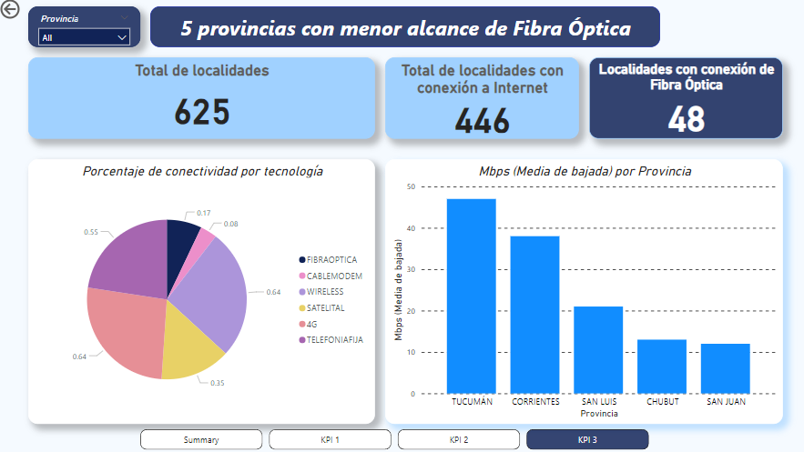

# <h1 align="center"> Telecommunication Data Analytics Project </h1>

## **Descripción del Proyecto**
Este proyecto se enfoca en analizar el desarrollo de la industria de las telecomunicaciones en Argentina, con el objetivo de mejorar el acceso a Internet en las diferentes provincias del país y comprender su impacto en la economía y la sociedad. A través de la utilización de conjuntos de datos proporcionados por ENACOM, se explorará la evolución de las distintas tecnologías a lo largo del tiempo y se investigará cómo han influido en los ingresos.

En la sociedad actual, la industria de las telecomunicaciones desempeña un papel fundamental al facilitar la comunicación a nivel internacional y permitir una conexión constante, incluso en situaciones de pandemia. Las telecomunicaciones se refieren a la transmisión de información mediante medios electrónicos como la telefonía, la televisión, la radio y, especialmente, Internet. Esta última ha transformado la forma en que nos comunicamos, trabajamos, aprendemos y nos entretenemos.

En Argentina, el acceso a Internet ha experimentado un notable crecimiento, alcanzando un total de 62,12 millones de conexiones para el año 2020.

# <h2 align="center"> Exploratory Data Analysis [(EDA)](https://github.com/whipped-coffee/Telecommunication-Data-Analytics-Project/blob/main/EDA.ipynb) </h2>

Dentro de este archivo, se describe el procedimiento inicial para obtener una visión general de los datos, con el objetivo de analizarlos y extraer información relevante que nos ayude a desarrollar nuestros indicadores clave de rendimiento (KPIs) y crear un panel de control (dashboard). Además, se encuentra el proceso de transformación de los datos de acuerdo a nuestras necesidades analíticas específicas.

# <h2 align="center"> Dashboard Interactivo [(dashboard)](https://github.com/whipped-coffee/Telecommunication-Data-Analytics-Project/blob/main/EDA.ipynb) </h2>

En este archivo de Power BI, encontrarás visualizaciones más intuitivas y gráficas de los datos, así como los KPIs diseñados para proporcionar información relevante sobre el mercado. Estos KPIs están destinados a facilitar la toma de decisiones estratégicas y determinar el curso de acción que la empresa debe seguir.

  

### KPI 1: Provincias con baja penetración de internet:

Explica las 5 provincias con el menor índice de acceso a internet por cada 100 hogares, y grafica información como la cantidad de localidades, la conectividad a nivel provincial, y la distribución de tecnologías.
 

  

Con este dashboard podemos notar que:
+ Las 5 provincias con menor penetración de internet cada 100 hogares son: `Santa Cruz`, `Formosa`, `Chaco`, `Mendoza` y `San juan`
+ El índice de conectividad provincial no es proporcional al índice de acceso a internet.
+ En los ultimos 4 años no cambiaron las provincias con menor índice de acceso a internet.

### KPI 2: Ingresos Trimestraless:

Explica la relación de los ingresos trimestrales por año con las tecnologías y la suba del promedio de velocidad de bajada por año.

  
  

Con este dashboard podemos notar que:
+ La suba de los ingresos parece tener relación con la llegada y crecimiento de la fibra óptica.
+ A partir de finales del 2018 que es donde se empezo a expandir la fibra óptica empezó el crecimiento tan grande tanto en ingresos como en promedio de velocidad de bajadas.
+ Una predicción de los ingresos del proximo trimestre obtenidos por el modelo realizado en el EDA.s

### KPI 3: Ingresos Trimestraless:

Al ser la fibra óptica uno de los mejores medios para transportar información, nos será útil conocer aquellas provincias con el menor promedio de conectividad por fibra óptica.

  

Con este dashboard podemos notar que:
+ Las 5 provincias con menor alcance de fibra óptica son: `Tucumán`, `Corrientes`, `San Luis`, `Chubut` y `San juan`
+ En promedio aquellas tecnologías que predominan son `Wireless`, `4G` y `Telefonía Fija`.

## **Recursos y Fuentes de Datos**
+ [PowerBI](https://powerbi.microsoft.com/es-es/): Página web oficial de la aplicacion de Microsoft donde vas a poder descargar la aplicacions para la visualizacion del dashboard.
+ [Datasets](https://datosabiertos.enacom.gob.ar/dashboards/20000/acceso-a-internet/): Este link te llevara a la pagina web oficial del ENACOM donde podras acceder a los distintos datasets que se trabajaron en este proyecto.

# **Disclaimer**
Este proyecto fue realizado durante la etapa de Labs de la academia Soy Henry. 
De parte del equipo de Henry se quiere aclarar y remarcar que los fines de los proyectos propuestos son exclusivamente pedagógicos, con el objetivo de realizar proyectos que simulen un entorno laboral, en el cual se trabajen diversas temáticas ajustadas a la realidad. No reflejan necesariamente la filosofía y valores de la organización. Además, Henry no alienta ni tampoco recomienda a los alumnos y/o cualquier persona leyendo los repositorios (y entregas de proyectos) que tomen acciones en base a los datos que pudieran o no haber recabado. Toda la información expuesta y resultados obtenidos en los proyectos nunca deben ser tomados en cuenta para la toma real de decisiones (especialmente en la temática de finanzas, salud, política, etc.)
